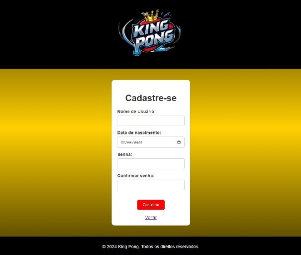

# King Pong

 

## Descrição do Projeto

King Pong é um jogo de ping pong onde os usuários podem criar e logar em suas contas para jogar uma partida contra o computador. O projeto combina uma interface intuitiva com uma jogabilidade desafiadora, ideal para quem quer passar um tempo se divertindo com um clássico dos games.

## Funcionalidades

- *Cadastro de Usuário*: Permite aos usuários criar contas.
- *Login de Usuário*: Permite aos usuários entrar em suas contas previamente criadas.
- *Jogo de Ping Pong*: Jogue contra o computador em uma partida de ping pong.
- *Placar e Estatísticas*: Acompanhe seu desempenho (pontuação) e seu progresso (round) no jogo.
- *Dificuldade escalável*: A cada round vencido pelo usuário o jogo fica mais rápido.
- *Interface Intuitiva*: Design simples e fácil de usar para uma experiência de jogo fluida.

## Demonstração

### LandingPage

### Cadastro

### Login

### Home (KingPong)

### Gameplay KingPong
